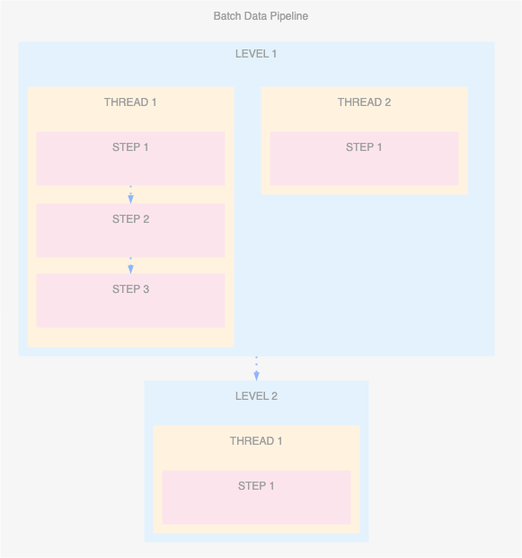
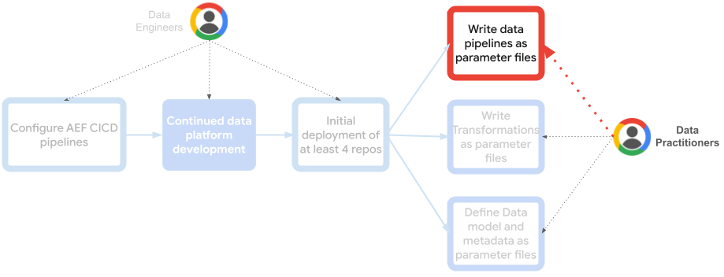

# Data Orchestration

***Note:*** For a comprehensive installation guide of all the AEF repositories together, please look [here](https://github.com/googlecloudplatform/aef-orchestration-framework/blob/main/AEF_DEPLOYMENT.md).

This repository automates the creation of [Google Cloud Workflows Definition](https://cloud.google.com/workflows/docs/reference/syntax) files or [Cloud Composer DAGs](https://cloud.google.com/composer/docs/how-to/using/writing-dags) from [data pipeline configuration files](https://github.com/googlecloudplatform/aef-data-orchestration/blob/main/workflow-definitions/demo_pipeline_cloud_workflows.json). 
It's designed for seamless integration into your CI/CD pipeline, using ***LEVEL***, ***THREAD***, and ***STEP*** abstractions to define your batch data pipeline. 
You also have the flexibility to directly execute ***workflows_generator.py*** for manual workflow definition generation.

## Key Features
- ***Abstracted Pipeline Definition:*** Conveniently define your batch data pipelines using the intuitive concepts of LEVEL, THREAD, and STEP.
- ***Manual Execution:*** Option to directly run ***workflows_generator.py*** for on-demand creation.
- ***CI/CD Integration:***  Effortlessly streamline your Cloud Workflows or Cloud Composer DAGs generation within your CI/CD pipeline.

##  Concepts
Most batch data pipelines can be effectively defined using three simple concepts, simplifying  pipeline creation and scheduling for data analysts:
- ***LEVEL:*** The largest aggregation within your pipeline. Levels execute sequentially, and you can have as many as needed. Identify each LEVEL with a unique ID.
- ***STEP:*** The atomic unit of execution. A STEP represents a data transformation process (e.g., Dataflow job, BigQuery job, Dataproc job).
- ***THREAD:*** Allows for complex dependencies and parallel execution within your pipeline. A THREAD groups steps that execute sequentially.  A LEVEL can have multiple THREADs running in parallel.



Find sample Json configuration files [here](https://github.com/googlecloudplatform/aef-data-orchestration/tree/main/workflow-definitions).

This approach enables data analysts to build intricate data pipelines and reliably orchestrate them without writing  code. Configuration is handled through simple JSON definition files containing levels, threads, and steps.

## Usage
### Manual Execution
This script processes a JSON-formatted data pipeline definition (specifying levels, threads, and steps) and generates deployment-ready code for your chosen orchestration platform:
- ***Cloud Workflows***: Produces a [source file](https://cloud.google.com/workflows/docs/reference/syntax#file_structure) that incorporates robust error handling, retry mechanisms, and cyclical execution. It invokes step executors as Cloud Functions --pre-deployed in your project, typically using the [Orchestration framework repository](https://github.com/googlecloudplatform/aef-orchestration-framework)--.
- ***Cloud Composer/Airflow***: Generates an Airflow DAG that leverages Google Cloud operators to execute the pipeline steps as defined in the JSON definition.
Both options rely on predefined [templates](https://github.com/googlecloudplatform/aef-data-orchestration/tree/main/workflows-generator) to streamline the code generation process.
```shell
python3 workflows_generator.py \
../workflow-definitions/etl_example_1.json \
../workflow-definitions/platform-parameters-dev.json \
workflows_etl_example_1.json \
False
```
### Terraform
The provided Terraform code enables reading defined JSON data pipelines definitions and managing the deployment of the resulting Cloud Workflows or Composer DAGs. In addition to the example using Terraform's `null_resource` to generate Cloud Workflows, these workflows can also be generated and deployed as a separate step within your CI/CD pipeline.
1. Locate your JSON data pipeline definition files in the repository.
```
├── workflow-definitions
│   ├── demo_pipeline.json
│   └── ...
```
2. Define your terraform variables.  It is recommended creating a `.tfvars` file.
<!-- BEGIN TFDOC -->
| name                                                      | description                                                                                                                                                           | type        | required | default                 |
|-----------------------------------------------------------|-----------------------------------------------------------------------------------------------------------------------------------------------------------------------|-------------|----------|--------------------------|
| [project](terraform/variables.tf#L17)                     | Project where the cloud workflows or Composer DAGs will be created.                                                                                                   | string      | true     | -                       |
| [region](terraform/variables.tf#L23)                      | Region where the AEF data orchestration workflows will be deployed.                                                                                                   | string      | true     | -                       |
| [environment](terraform/variables.tf#L29)                 | AEF environment. Will be used to create the parameters file for Cloud Workflows: **platform-parameters-$ENVIRONMENT.json**                                            | string      | true     | -                       |
| [data_transformation_project](terraform/variables.tf#L35) | Project where the data transformation jobs definitions reside (will be used to infer bucket storing job parameter json files).                                        | string      | true     | -                       |
| [deploy_cloud_workflows](terraform/variables.tf#L41)      | Controls whether cloud workflows is generated and deployed alongside Terraform resources. If false cloud workflows can be deployed as a next step in a CICD pipeline. | bool        | false    | `true`                  |
| [deploy_composer_dags](terraform/variables.tf#L48)        | Controls whether Airflow DAGs are generated and deployed alongside Terraform resources. If false DAGs could be deployed as a next step in a CICD pipeline.            | bool        | false    | `false`                 |
| [create_composer_environment](terraform/variables.tf#L55) | Controls whether a composer environment will be created, If false and **deploy_composer_dags** set to **true**, then **composer_bucket_name** needs to be set.        | bool        | false    | `false`                 |
| [composer_bucket_name](terraform/variables.tf#L62)        | If Composer environment is not created and deploy_composer_dags is set to true, then this will be used to upload DAGs to.                                             | string      | false    | -                       |
| [composer_config](terraform/variables.tf#L69)             | Cloud Composer config.                                                                                                                                                | object      | false    | `{}`                    |
| [workflows_log_level](terraform/variables.tf#L120)        | Describes the level of platform logging to apply to calls and call responses during executions of cloud workflows                                                     | string      | false    | `LOG_ERRORS_ONLY` |
<!-- END TFDOC -->


### Domain-Based vs. Central Orchestration

The [engine](https://github.com/GoogleCloudPlatform/aef-data-orchestration/blob/3eb62a2a264c8b73585c0b3521fa8f492d2d2fc5/workflow-definitions/demo_pipeline_composer.json#L2) variable currently supports `cloud_workflows` or `composer`. 

*   `cloud_workflows`:  Deploy Cloud Workflows in the project specified by the `project` variable. This allows for both **Domain-Based Orchestration** (deploying to a domain team's project) and **Central Orchestration** (deploying to a centralized project).

*   `composer`: Creates/uses a Composer environment in the data domain team's project, following a **Domain-Based Orchestration** approach. This addresses [Airflow scalability complexity](https://cloud.google.com/blog/products/data-analytics/scale-your-composer-environment-together-your-business?e=48754805) and aligns with [tenancy strategies for Cloud Composer](https://cloud.google.com/blog/products/data-analytics/a-cloud-composer-tenancy-case-study?e=48754805).

**Domain-Based Orchestration**: Isolates orchestration by domain, potentially simplifying IAM and networking but increasing operational overhead. Preferred for multi-domain environments with distinct data needs. This repository demonstrates this with one Composer environment per data domain team.

**Central Orchestration**: Consolidates orchestration, centralizing Data Ops and potentially reducing management complexity. Simpler for single-domain environments or those with shared networks. May require IAM adjustments. Easily achieved with Cloud Workflows due to its serverless nature.

The optimal approach depends on your organization's needs and constraints, including the number of domains, data access patterns, and networking configurations.

## Integration with Analytics Engineering Framework
Data orchestration plays a vital role in enabling efficient data access and analysis, making it critical for data lakes and data warehouses.

While usable independently, this tool is optimized as a component within a comprehensive Analytics Engineering Framework comprising:

1. [Orchestration Framework](https://github.com/googlecloudplatform/aef-orchestration-framework): Maintained by Analytics Engineers to provide seamless, extensible orchestration and execution infrastructure.
1. [Data Model](https://github.com/googlecloudplatform/aef-data-model): Directly used by end data practitioners to manage data models, schemas, and Dataplex metadata.
1. **(This repository) Data Orchestration**: Directly used by end data practitioners to define and deploy data pipelines using levels, threads, and steps.
1. [Data Transformation](https://github.com/googlecloudplatform/aef-data-transformation): Directly used by end data practitioners to define, store, and deploy data transformations.


